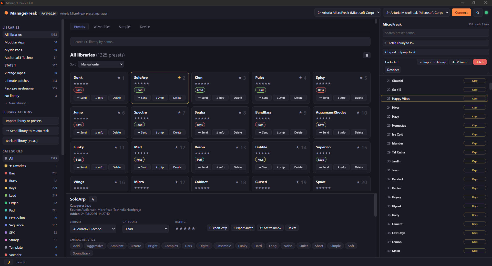
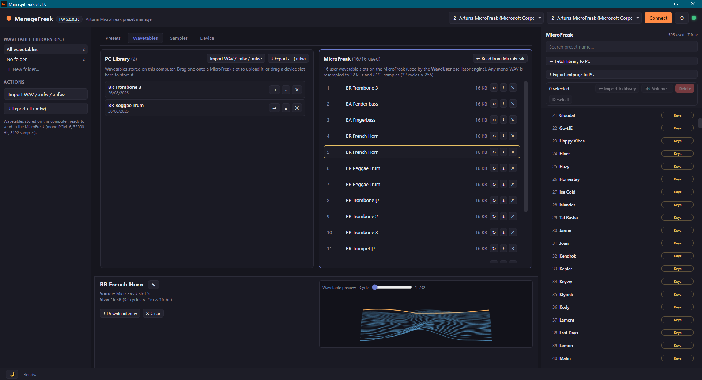
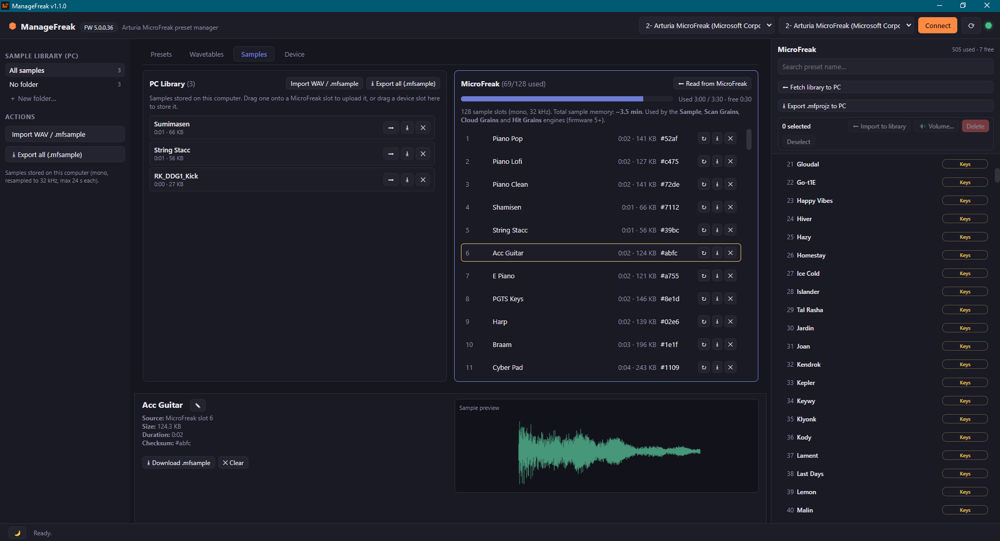
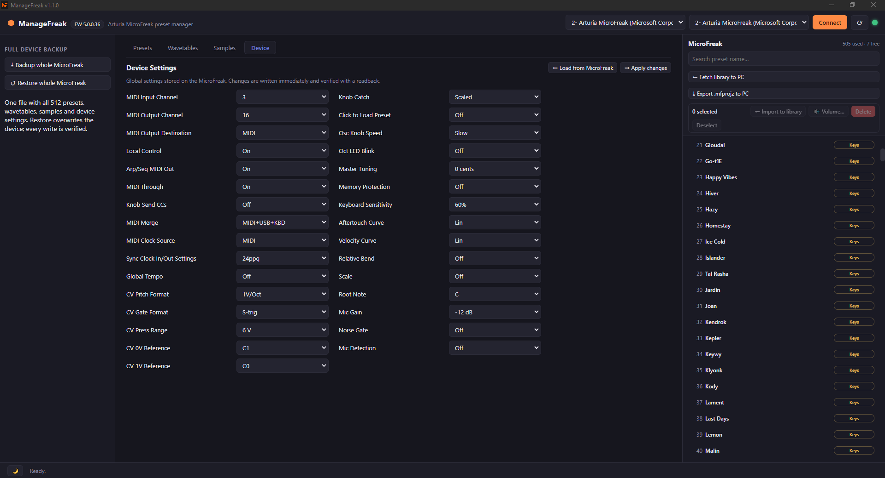

# ManageFreak

**Open-source preset manager for the Arturia MicroFreak**, cross-platform (Windows, macOS, Linux).

ManageFreak is a lightweight, fast alternative to Arturia MIDI Control Center for organizing
MicroFreak presets: backup of the 512 slots, a local library with **Arturia categories and
characteristics**, safe writes **with readback verification**, and import/export of Arturia MCC
files (imports `.mfp`, `.mbp`, `.mfpz`, `.mfprojz`, `.syx`; exports `.mfp`, `.mfpz`, `.mfprojz`).

> ⚠️ **Unofficial project.** ManageFreak is not affiliated with, endorsed by, or sponsored by
> Arturia. *MicroFreak* is a trademark of Arturia.

---
## Screenshots









---
### TLDR
- Easy **drag & drop**, **sorting** and **organizing** of presets, wavetables and samples: sort
  the PC library by name, category, rating or characteristics, and move content on the synth by
  dragging presets from one slot to another;
- Easy **rename** of presets, wavetables and samples directly on the device;
- Fast **batch and multi-selection volume editing** of presets;
- Automatic **sample conversion** to the right format: no need to check bitrates or sampling frequencies;
- Samples and wavetables **preview**;
- Many **backup** functionalities.

## Features

### Main device-wide features
- **Automatic scan of all 512 presets** (name, Arturia category, used/empty state) **and of the
  wavetable and sample slots**, in seconds;
- **Rename** a preset on the device (header only, the sound is untouched);
- **Drag & drop**: drop a library preset onto a device slot to write it;
- **Reorder presets on the device**: swap or shift, with backup + verification + rollback;
- **Multi-selection** with Ctrl/Shift and batch actions (move, favorites, set volume,
  export, delete) from the detail pane;
- **Batch volume edit**: set the Volume (**−12…+12 dB**, as shown on the MicroFreak) of all
  selected presets at once, on the device or in the PC library;
- **Audition/select** a preset on the synth from the computer (Bank Select + Program Change);
- **Initialize** slots back to the *Init* preset, with smart grey visualization to easily spot them;
- **Download the whole bank** as a single `.mfprojz` file compatible with Arturia MCC;
- **Import** single presets (`.mfp`, `.mbp`, `.mfpz`), MCC projects (`.mfprojz`, many presets
  at once), sysex (`.syx`) and ManageFreak JSON backups (restores libraries too);
- **Export** single presets (`.mfp` / `.mfpz`) and JSON backups.

### Library
- **Libraries (collections)**: choose or create a destination library when importing, so
  presets don't pile up together. Move presets between libraries from the detail pane;
- **Grid or list view** (toggle ☰ / ▦ in the library header);
- **Search by name**, **sort** (manual / name / rating / category), **star rating**;
- **Arturia categories** (Bass, Brass, Keys, Lead, Organ, Pad, Percussion, Sequence, SFX, Strings, Template, Vocoder) with smart counts (Init presets are excluded from them);
- **Arturia characteristics** (Acid, Aggressive, Ambient, … 18 total): filter by them and
  toggle them per preset from the detail pane;
- **★ Favorites** extra entry;
- **Parameter view** of the preset (oscillator type, cutoff, resonance, envelopes, LFO, arp,
  modulation matrix…), decoded from the firmware-5 tagged format.

## Tabs (MCC-style)

- ### **Wavetables**:
	- 16 user wavetable slots on the device, split view (PC library ↔ MicroFreak) with independent scrolling;
	- Import `.wav` (any WAV: auto-converted to mono PCM16, resampled to 32 kHz with an anti-aliasing filter, trimmed/repeated to exactly 8192 samples), `.mfw`, `.mfwz`;
	- Download `.mfw`/`.mfwz`;
	- Clear slots;
	- Drag & drop both ways;
	- **Visual preview** of the selected wavetable (perspective ribbon of the 32 cycles, with a cycle slider).
- ### **Samples**:
	- 128 sample slots (firmware 5+) with a **memory time counter** (total ~3.5 min);
	- Split view (PC library ↔ MicroFreak) with independent scrolling;
	- Import `.wav` (any WAV: auto-converted to mono PCM16 and resampled to 32 kHz with an anti-aliasing filter, max 24 s);
	- `.mfsample` backups;
	- Download;
	- Clear;
	- Drag & drop both ways;
	- Waveform preview in the details pane.

- ### **Device**:
	- **31** device settings in this tab (MIDI channels, clock, CV, knob behavior, tuning, keyboard, microphone…) with the **audited allowed values** from Arturia's device description;
	- Changes are written with readback verification and automatic rollback;
	- Backups and restores cover all **43** device settings, including the ones not shown in this tab.

- A **details pane** at the bottom shows name/source/size for the clicked preset,
  wavetable or sample, with inline **rename** (on the device or in the PC library).

### App specific features
- **Safe write**: before writing, the slot is read as a backup; the readback is verified
  byte-by-byte and, on any error, **the original content is restored automatically**.
  (Samples are the exception: there the slot is checked first, free sample memory is
  verified, the readback is compared byte-by-byte with a small tolerance on the last bytes,
  which the firmware zeroes, and a failed write leaves the slot **empty**, never corrupted.
  The previous sample is *not* restored, so keep a local copy of anything irreplaceable).
- **In-app updates** (installed Windows build): from the app-name menu (top-left) you can see
  the current version, the changelog of the latest release, check for updates and update
  with one click.

---
## Download & install

Prebuilt packages are published on the [Releases](https://github.com/GiovanniBitbyBit/managefreak/releases) page. Download the one for your platform — no build tools needed.

| Platform                  | File                                        | How to install                                                                                           | In app updates |
| ------------------------- | ------------------------------------------- | -------------------------------------------------------------------------------------------------------- | -------------- |
| **Windows**               | `ManageFreak-Setup-<version>.exe`           | Run the installer. It installs for the current user (no admin rights)                                    | Yes            |
| **Windows, portable**     | `ManageFreak-<version>-portable.exe`        | Single file, nothing to install: just run it.                                                            | No             |
| **macOS**                 | `ManageFreak-<version>.dmg` (or the `.zip`) | Open the DMG and drag *ManageFreak* into *Applications*. The app is **not signed** — see the note below. | No             |
| **Linux**                 | `ManageFreak-<version>.AppImage`            | `chmod +x ManageFreak-*.AppImage`, then run it.                                                          | No             |
| **Linux (Debian/Ubuntu)** | `ManageFreak-<version>.deb`                 | `sudo apt install ./ManageFreak-<version>.deb`                                                           | No             |

Everything the app stores (library, sample and wavetable collections) stays in your user folder:
see [Where the data lives](#where-the-data-lives).

### Windows: first launch

The Windows installer is not code-signed, so on first launch SmartScreen may show
*"Windows protected your PC"*. Click **More info → Run anyway**: the app is safe, and its
whole source is public if you want to check it yourself.

### macOS: first launch

Unfortunately I can't afford an Apple Developer Program membership (Developer ID certificate)
just yet for a free and open source project, so I can't sign the app. Because of that macOS
tends to treat it as malware even though it is not.

The first time you open it, macOS blocks it with a message like *"ManageFreak is damaged"* or
*"unidentified developer"*. The application itself is fine.

Pick either workaround:

- **Right-click** the app in *Applications* → **Open** → **Open** again (macOS remembers the choice from then on);
- or **remove the quarantine flag** once, from Terminal:

  ```bash
  xattr -dr com.apple.quarantine /Applications/ManageFreak.app
  ```

In-app updates are not available on the macOS and Linux builds (see [Known limitations](#known-limitations)).

**IMPORTANT!**
- If you suspect any malware presence in the app just audit it, all of its code is open source. Nothing to hide here.
- I do not possess a Mac, so I just build the app for it without the possibility to check if there are platform specific problems. **If you find any problem, please report it** on the Reddit posts I made or on GitHub. Thank you for your understanding.
- I was helped by AI to build the app. I personally don't find anything wrong with it, as it is very good at coding. It obviously takes a lot of time to build it anyway. I just report it here for transparency and because for some people it might be a deal breaker. I think you have to try things out before complaining.

---
## Requirements

To **use** the prebuilt binaries:
- none, just plug the MicroFreak in over USB.

To **build from source**:
- [Node.js](https://nodejs.org) 18+ (20/22 recommended)
- npm

> Writes are verified on **MicroFreak firmware 5.x** (the same protocol verified on hardware
> by Elektroid and freakout). Reading uses the same documented operation family that also
> works on earlier firmware; read presets are saved losslessly either way.
>
> Hardware-verified on a real MicroFreak: preset read/write/rename/reorder, wavetable and
> sample read/write, **sample and wavetable rename and reorder (swap/shift)**. Sample
> reordering rewrites only the directory entries, so it is fast even for large samples,
> and device settings read/write.
>
> MIDI goes through **RtMidi** in the main process (WinMM on Windows, CoreMIDI on macOS,
> ALSA on Linux), with prebuilt binaries bundled in every package: the same MIDI stack used
> by DAWs and by MIDI Control Center. Web MIDI stays as a fallback if the native module
> cannot be loaded on an uncommon platform.

---
## Quick start

1. **Connect** the MicroFreak over USB and turn it on.
2. Open ManageFreak: the MicroFreak MIDI ports are detected automatically (top bar). Otherwise select them from the drop down menus and press **Connect**.
3. The 512 slots are scanned automatically; use **⬅ Fetch library to PC** for a full
   backup of the occupied presets (it takes a few minutes).
4. Organize your content in the **Library**: drag presets to reorder, drop device slots onto the grid
   to import them at a chosen position, assign categories/characteristics, search, rate,
   mark favorites.
5. To send a preset to the synth: drag it onto a slot in the MicroFreak panel — the app asks
   for confirmation and tells you **which preset is being replaced** — or use **➡ Send** on the
   card and type the destination slot (it starts from slot 1). The destination slot is
   **overwritten**, so send the current content somewhere else first if you want to keep it.
6. **Export** presets as `.mfp`/`.mfpz` to share them or reuse them in Arturia MCC.

### Migrating an existing library from Arturia MCC

1. In MCC: select your presets and use *Export* (single presets or the whole project).
2. In ManageFreak: **Import library or presets** and pick the exported files.
3. From then on, manage everything from ManageFreak, except known limitations.

---
## Where the data lives

The app keeps three files in its data folder:
- `library.json` — the PC library (presets, libraries/collections, categories, ratings);
- `wavetables.json` — the wavetable collection saved on the PC;
- `samples.json` — the sample collection saved on the PC.

The folder is:
- `%APPDATA%/ManageFreak` on Windows;
- `~/Library/Application Support/ManageFreak` on macOS;
- `~/.config/ManageFreak` on Linux.

Use **Backup library (JSON)** to move your data to another PC.

---
## Network access

ManageFreak works offline: presets, libraries and backups never leave your computer. The only
network calls the app makes are:

- the **changelog** shown in the app menu (top-left), read from the public GitHub API;
- the **update check**, which asks GitHub whether a newer release exists (installed Windows
  build only).

Both are read-only and optional: with no network the app simply reports that the changelog is
unavailable and keeps working.

---
## Known limitations

- ManageFreak cannot update your MicroFreak firmware, use MCC for that.
- **Init (empty) slots** are read and shown, but cannot be recreated via upload with the current protocol (same limitation documented by [freakout](https://github.com/kmorrill/freakout) and [Elektroid](https://github.com/dagargo/elektroid)). To totally empty a slot, use MCC. ManageFreak's *Delete* action rewrites the firmware Init template preset instead.
- **Sequences (Seq A/B)** are transferred *integrally* inside the preset body (lossless backup), but are not yet editable from the UI.
- **Auto-update** works only on the installed Windows build (NSIS), and only from version
  1.1.0 onwards: 1.0.3 and earlier have no updater and must be updated by hand once. The
  portable `.exe` and the macOS/Linux builds are not wired to the updater yet (on macOS a
  signed and notarized app is required for a smooth update experience).
- The protocol was obtained by **reverse engineering**: always test on disposable slots
  before important operations, and keep a library backup.
- The **Windows GS Wavetable Synth** and the **MIDI Mapper** ports are deliberately hidden
  from the port lists: they go through `wdmaud.drv`, which crashes on MicroFreak SysEx (the
  app refuses to open them even if asked). Pick the MicroFreak ports instead.

---
## Development

```bash
cd app
npm install        # installs Electron
npm start          # runs the app
npm test           # runs the automated tests (protocol, file formats, parameters)
```

## Building installers

```bash
cd app
npm run dist:win     # Windows: NSIS installer + portable build
npm run dist:mac     # macOS: DMG + zip
npm run dist:linux   # Linux: AppImage + deb
```

Packages are generated in `app/dist/`. On Linux machines you need the ALSA libraries (for audio/MIDI): `sudo apt install libasound2`.

---

## Technical background & credits

The SysEx protocol used by ManageFreak is documented in [`app/docs/PROTOCOLLO.md`](app/docs/PROTOCOLLO.md) (Italian) and derives from the public work of:

- [Elektroid](https://github.com/dagargo/elektroid) (MicroFreak connector, GPL) hardware-verified read/write sequences;
- [freakout](https://github.com/kmorrill/freakout) (MIT) complete protocol documentation, `.mfp`/`.mfpz`/`.mfprojz` format, firmware-5 tagged parameter format;
- [microfreak-reader](https://github.com/francoisgeorgy/microfreak-reader) by François Georgy early studies on the read protocol and the CC parameter map.

---

## Support

ManageFreak is free and open source. If it saves you time (or sanity) compared to MIDI Control Center, consider helping me by buying me a coffee:

[](https://ko-fi.com/markgionus)

---

## License

GPL-3.0-or-later. See [LICENSE](LICENSE).
